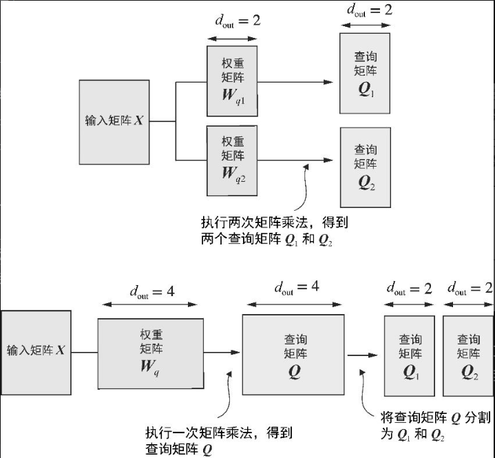
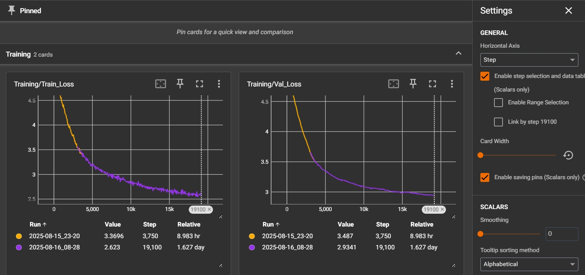
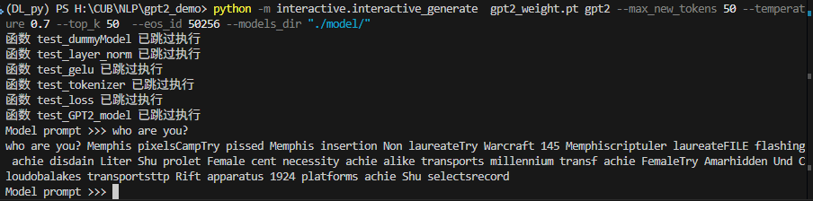

# gpt2_demo

**目标**：
* 从零实现一个GPT2架构的模型--DummyGPT, 用中文数据跑通预训练流程
* 用HF上的GPT2来验证DummyGPT模型架构

## 文件夹结构

    ├── GPT2_DEMO
    │   ├── datasets                        # 数据集
    │   │   ├── the-verdict.txt             # en data 前期测试用
    │   │   └── wikipedia                   # cn data 约500MB
    │   ├── interactive
    │   │   └── interactive_generate.py     # 命令行交互模型
    │   ├── log                             # tensorboard 日志
    │   ├── model                           # 存储训练好的模型
    │   ├── src
    │   │   ├── DummyGPT_with_weight.ipynb  # 复用OpenAI gpt2 weights
    │   │   ├── DummyGPT.ipynb              # 训练模型
    │   │   ├── loaddata.ipynb              # 数据加载
    │   │   ├── loaddata.py                 #（导出的py，readonly）
    │   │   ├── model_wrapper.ipynb         # 模型组成模块
    │   │   ├── model_wrapper.py            #（导出的py，readonly）
    │   │   ├── models.ipynb                # 定义模型
    │   │   ├── models.py                   #（导出的py，readonly）
    │   │   └── tools.py                    # Python 装饰器
    │   ├── .gitattributes
    │   ├── .gitignore
    │   ├── README.md
    │   └── requirements.txt

## model_wrapper
* **Tokenizer** : 使用OpenAI的 tiktoken 库(OpenAI开发主要用于 GPT-3.5/4)
   * en 用的 gpt2， vocab_size = 50257
   * cn 用的 cl100k_base ，兼容中文 vocab_size = 10256
  
* **Layer Norm** :  unbiased =False
* **Activation Function**: GELU，未使用官方torch.erf，利用近似计算
* **FNN**：两层Linear 升维--Gelu--降维--Dropout
* **MultiHeadAttendtion**:
  * CausalAttention: 因果注意力
  * MultiHeadAttendtion: 堆叠多个CausalAttention，参数量num_heads×d_model× d_out
  
    (如果d_out=d_model,参数量爆炸，可设置d_out=d_model/num_heads)
  * MultiHeadAttendtion_new : 参数量num_heads×d_model×head_dim, head_dim=d_model/num_head同上的d_out,比上优点只执行一次矩阵乘法 
    
    

* **Transformer block**:
  * 注意力分支：LayerNorm1 -> Attn -> Dropout -> 残差连接
  *  FFN分支：LayerNorm2 -> FFN -> Dropout -> 残差连接

* **GPT DataLoader**：滑动窗口生成样本
* **Loss Function**:  交叉熵
* **Generate text**：
  * generate_text_greedy ：贪心策略（Greedy Search）解码
  * generate_text_withsample：Top-k/Top-p采样+temperature+随机采样解码
  
## DummyGPT 训练模型

匹配 GPT2 124M 参数

    "vocab_size": 50257,     
    "context_len": 1024,  
    "emb_dim": 768,          
    "n_heads": 8,          
    "n_layers": 12, 

Datasets： pleisto/wikipedia-cn-20230720-filtered  摘取了2w 条中文句子(wiki数据包含了部分多语言数据：日语、俄语)

Epochs: 4
Batch_size: 8

训练损失呈下降趋势，模型在学习训练数据的模式，不断优化。训练损失和验证损失整体趋势一致，模型没有出现明显的过拟合。

## DummyGPT with weights 

(只针对EN，原GPT2不支持中文)

用DummyGPT的模型架构，加载OpenAI GPT2的weights参数（GPT2LMHeadModel.from_pretrained("gpt2")），验证模型架构是否正确，对比两个模型的生成能力。

**核心方法**：load_openai_weights，手动匹配模型各层的state_dict

**问题：生成效果不及原模型** ：
详见DummyGPT_with_weight.ipynb的输出
1. ActivationFunction 不一样可能会产生误差，在自回归下误差会累积放大
2. nn.Conv1d和nn.Linear的区别？(数学本质上是一样的)
3. 原模型执行了 prune_heads，移除了冗余的头，提升了泛化能力

## Interactive 

interactive_generate.py 与指定模型的交互脚本

命令行输入prompt测试模型生成能力

**TODO:** 加载预训练的参数，进行模型Fine-tunning